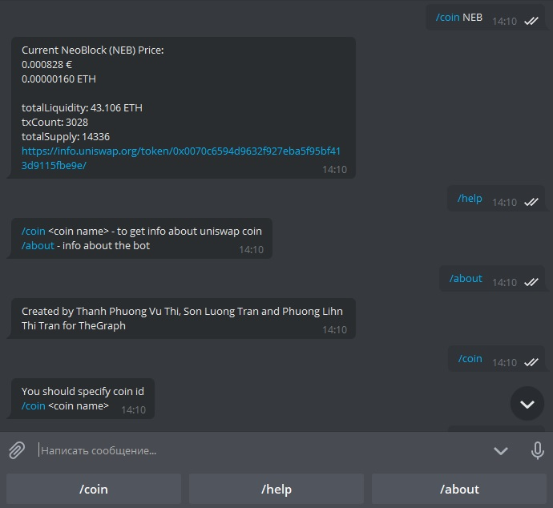

[Telegram Uniswap TheGraph Bot](https://t.me/UniswapTheGraphBot)
=====================

[](https://github.com/Der-Eddy/discord_bot)
[](https://raw.githubusercontent.com/Der-Eddy/telegram_crypto_bot/master/LICENSE)

A simple crypto currency Uniswap bot based on python-telegram-bot and the newest Python 3. The bot uses the [subgraph API](https://thegraph.com/explorer/subgraph/uniswap/uniswap-v2) to obtain data



Commands List
-------------
Command | Discription | Usage
----------------|--------------|-------
`/coin` | Shows the current price (and other information) of one given cryptocurrency | `/coin DAI`
`/help` | Shows list of commands | `/help`
`/about` | Shows info about the bot | `/about`

Run
-------------
Either run it directly via `python3 main.py` or use systemd. An example for a systemd service can be found at `telegram.service.example`:

    [Unit]
    Description=Telegram Crypto Bot
    After=multi-user.target
    [Service]
    WorkingDirectory=/home/eddy/telegram_bot
    User=eddy
    Group=eddy
    ExecStart=/usr/bin/python3.6 /home/eddy/telegram_bot/main.py
    Type=idle
    Restart=on-failure
    RestartSec=15
    TimeoutStartSec=15

    [Install]
    WantedBy=multi-user.target


Settings
-------------

Set `UNISWAP_BOT_TOKEN` environment variable

```console
$ export UNISWAP_BOT_TOKEN=tspOGQiAoEqdEEEBzinmhJg4VuvenEzKiH39NzsZQqDDq
```

Don't forget to allow groups at [@BotFather](https://telegram.me/BotFather) if you want to add the bot to groups.

List of requirements
-------------

    python>=3.6.0
    python-telegram-bot
    python-graphql-client